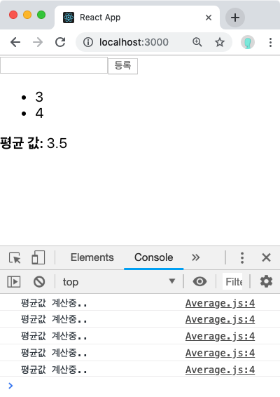
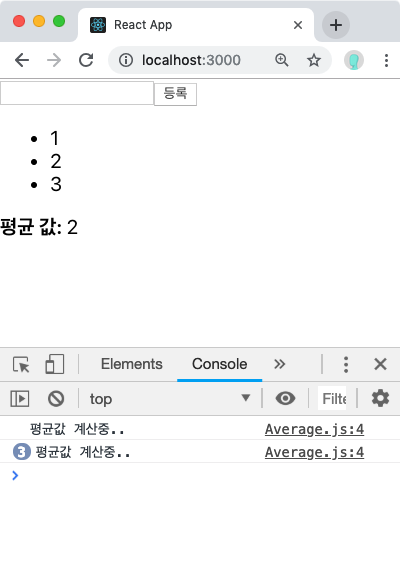

# Hooks 

---

# Hooks
- React 16.8 버전에 새로 추가
- 클래스 컴포넌트를 작성하지 않아도 state와 같은 특징을 사용할 수 있음

---
# useState 
- 가장 기본적인 hook이며 가변적인 상태를 지닐 수 있게 해줌
- 사용법
  - `const [state, setState] = useState(initialState);`


``` javaScript
import React, { useState } from 'react';

function Example() {
  // 새로운 state 변수를 선언하고, count라 부르겠습니다.
  const [count, setCount] = useState(0); // 상태의 기본값을 설정

  return (
    <div>
      <p>You clicked {count} times</p>
      <button onClick={() => setCount(count + 1)}>
        Click me
      </button>
    </div>
  );
}							         			                                    
```
***
## useState 여러번 사용
``` javaScript
import React, {useState} from 'react';

const Info = () => {
  const [name, setName] = useState('')
  const [address, setAddress] = useState('')

  const onChangeName = e => {
    setName(e.target.value)
  }

  const onChangeAddress = e => {
    setAddress(e.target.value)
  }

  return (
    <div>
      <h1>useState example</h1>
      <div>
        <input value={name} onChange={onChangeName} />
        <input value={address} onChange={onChangeAddress} />
      </div>   
    </div>                                                                                                                     
  );
};
```

---
# useEffect
- 리액트 컴포넌트가 렌더링될 때마다 특저 작업을 수행하도록 설정할 수 있는 Hook
- 클래스형 컴포넌트의 **componentDidMount**, **componentDidUpdate**, **componentWillUnmount** 합친 기능과 비슷함
- 사용법
  - `useEffect(didUpdate);`

***
### 마운트 될 때만 실행 하고 싶을 때
- 맨 처음 렌더링 될 때만 실행하고, 업데이이트 될 때는 실핼 할 경우
  
```javaScript
useEffect(()=>{
	console.log('마운트 될 경우에만 실행');
}, []); // 두 번째 파라미터로 비어 있는 배열을 넣어줌
```

***

### <!-- fit --> 특정값이 업데이트 될 때만 실행 하고 싶을 때
<!-- _class: split -->

<div class=ldiv>

#### 클래스형 컴포넌트
``` javaScript
componentDidUpdate(prevProps, prevState) {
	if( prevProps.value !== this.props.value) {
		// do something...
	}
}
``` 
</div>
<div class=rdiv>

#### 함수형 컴포넌트
``` javaScript
useEffect(()=>{
	console.log('업데이트 될 경우에만 실행');
}, [name]);

``` 
</div>

***

### 정리(clean_up)를 이용하는 Effects
- 네트워크 요청, DOM 수행 동작, 로깅 등은 clean-up이 필요 없음
  - 실행 이후 신경 쓸 것이 없음
- 외부데이터에 subscription을 설정해야 하는 경우  메모리  누수가 발생하지 않도록 clean-up 하는 것이 중요함
``` javaScript
function FriendStatus(props) {
  const [isOnline, setIsOnline] = useState(null);

  useEffect(() => {
    function handleStatusChange(status) {
      setIsOnline(status.isOnline);
    }
    ChatAPI.subscribeToFriendStatus(props.friend.id, handleStatusChange);
    return function cleanup() {// effect 이후에 어떻게 정리(clean-up)할 것인지 표시합니다.
      ChatAPI.unsubscribeFromFriendStatus(props.friend.id, handleStatusChange);
    };
  });

  if (isOnline === null) {
    return 'Loading...';
  }
  return isOnline ? 'Online' : 'Offline';
}																	                            
```
  

---

# useReducer
- useState의 대체 함수(Redux에서 좀 더 자세히)
- `(state, action) => newState`의 형태로 reducer를 받고 dispatch 메서드와 짝의 형태로 현재 state를 반환
- 컴포넌트 업데이트 로직을 컴포넌트 바같에서 구현 할 수 있는 장점이 있음
- 사용법
  - <span style="font-size:90%">`const [state, dispatch] = useReducer(reducer, initialArg, init);` </span>

***
- reducer
``` javaScript
function reducer(state, action) {
    return {...} // 불변성을 지키면서 업데이트한 새로운 상태를 반환
}
```
- action은 보통 다음 형태로 구성됨
``` javaScript
{
    type: 'INCREMENT',
    //다른 값들이 필요하면 추가로 들어감
}
```

***

- 예제
``` javaScript
const initialState = {count: 0};

function reducer(state, action) {
  switch (action.type) {
    case 'increment':
      return {count: state.count + 1};
    case 'decrement':
      return {count: state.count - 1};
    default:
      throw new Error();
  }
}

function Counter() {
  const [state, dispatch] = useReducer(reducer, initialState);
  return (
    <>
      Count: {state.count}
      <button onClick={() => dispatch({type: 'decrement'})}>-</button>
      <button onClick={() => dispatch({type: 'increment'})}>+</button>
    </>
  );
}                                                                                                                       
```


---

# useMemo
- 메모이제이션된 값을 반환
- 함수형 컴포넌트 내부에서 발생하는 연산을 최적화 할 수 있음
- 사용법
``` javaScript
const memoizedValue = useMemo(() => computeExpensiveValue(a, b), [a, b]);
```

***

<!-- _class: split2 -->

<div class=ldiv>

-  useMemo를 사용하지 않을 경우
``` javaScript
const getAverage = numbers => {
  console.log('평균값 계산중..');
  if (numbers.length === 0) return 0;
  const sum = numbers.reduce((a, b) => a + b);
  return sum / numbers.length;
};

const Average = () => {
  const [list, setList] = useState([]);
  const [number, setNumber] = useState('');

  const onChange = e => {
    setNumber(e.target.value);
  };
  const onInsert = e => {
    const nextList = list.concat(parseInt(number));
    setList(nextList);
    setNumber('');
  };

  return (
    <div>
      <input value={number} onChange={onChange} />
      <button onClick={onInsert}>등록</button>
      <ul>
        {list.map((value, index) => (
          <li key={index}>{value}</li>
        ))}
      </ul>
      <div>
        <b>평균 값:</b> {getAverage(list)}
      </div>
    </div>
  );
};                                                                                         
``` 
</div>
<div class=rdiv>


- 결과 
   <span style="font-size:60%">input 이벤트가 발생할때마다 getAverage 함수가 호출 </span>

</div>

***

<!-- _class: split2 -->

<div class=ldiv>

-  useMemo를 사용할 경우
``` javaScript
const getAverage = numbers => {
  console.log("평균값 계산중..");
  if (numbers.length === 0) return 0;
  const sum = numbers.reduce((a, b) => a + b);
  return sum / numbers.length;
};

const Average = () => {
  // state 초기화
  const [list, setList] = useState([]);
  const [number, setNumber] = useState("");

  const onChange = e => {
    console.log("onchange");
    setNumber(e.target.value);
  };

  const onInsert = () => {
    console.log("onInsert");
    const nextList = list.concat(parseInt(number));
    setList(nextList);
    setNumber("");
  };

  const avg = useMemo(() => getAverage(list), [list]); // list 배열이 바뀔때만 getAverage 함수 호출

  return (
    <div>
      <h1>useMemo example</h1>
      <input value={number} onChange={onChange} />
      <button onClick={onInsert}>등록</button>
      <ul>
        {list.map((value, index) => (
          <li key={index}>{value}</li>
        ))}
      </ul>
      <div>
        <b>평균값:</b> {avg}
        <br />
        {/* <b>평균값:</b> {getAverage(list)} */}
      </div>
    </div>
  );
};                                                        
``` 
</div>
<div class=rdiv>


- 결과
  <span style="font-size:60%">list 배열아 업데이터 될 경우에 getAverage 호출 </span>

</div>


---


# useCallback
- 메모이제이션된 callback을 반환
- 사용법
``` javaScript
const memoizedCallback = useCallback(
  () => {
    doSomething(a, b);
  },
  [a, b],
);
```
- `useCallback(fn, deps) = useMemo(() => fn, deps)`

***

- useCallback을 이용한 getAverage
``` javaScript
const getAverage = numbers => {
  console.log("평균값 계산중..");
  if (numbers.length === 0) return 0;
  const sum = numbers.reduce((a, b) => a + b);
  return sum / numbers.length;
};

const Average2 = () => {
  // state 초기화
  const [list, setList] = useState([]);
  const [number, setNumber] = useState("");

  const onChange = useCallback(e => {
    console.log("onchange")
    setNumber(e.target.value);
  }, []); // 컴포넌트가 처음 렌더링 될 때만 함수 생성

  const onInsert = useCallback(() => {
    console.log("onInsert")
    const nextList = list.concat(parseInt(number));
    setList(nextList);
    setNumber("");
  },[number, list]); // number 혹은 list 가 바뀌었을 때만 함수 생성

  const avg = useMemo(() => getAverage(list), [list]);

  return (
    <div>
      <h1>useCallback example</h1>
      <input value={number} onChange={onChange} />
      <button onClick={onInsert}>등록</button>
      <ul>
        {list.map((value, index) => (
          <li key={index}>{value}</li>
        ))}
      </ul>
      <div>
        <b>평균값:</b> {avg}
      </div>
    </div>
  );
};
```

***

### <!-- fit --> `useCallback(fn, deps) = useMemo(() => fn, deps)`  
<!-- _class: split -->

<div class=ldiv>

#### useCallback

```javaScript
useCallback(() => {
  console.log('hello world!');
}, [])
```
</div>
<div class=rdiv>

#### useMemo
```javaScript
useMemo(() => {
  const fn = () => {
    console.log('hello world!');
  };
  return fn;
}, [])
```
</div>


---

# useRef
- 사용법
  - `const refContainer = useRef(initialValue);`
```javaScript
function TextInputWithFocusButton() {
  const inputEl = useRef(null);
  const onButtonClick = () => {
    // `current` points to the mounted text input element
    inputEl.current.focus();
  };
  return (
    <>
      <input ref={inputEl} type="text" />
      <button onClick={onButtonClick}>Focus the input</button>
    </>
  );
}                                                                                               
```
***

## 로컬 변수로 사용하기
- 렌더링과 관계없는 값을 useRef를 통해 변경 가능
```javaScript
const RefSample = () => {
  const id = useRef(1);
  const setId = (n) => {
    id.current = n;
  }
  const printId = () => {
    console.log(id.current);
  }
  return (
    <div>
      refsample
    </div>
  );
};
```
---

# custom Hooks
**제목** 
- 내용 
- 내용

---

# 이외의 다양한 Hooks

- [ https://github.com/rehooks/awesome-react-hooks ](https://github.com/rehooks/awesome-react-hooks)
- [ https://nikgraf.github.io/react-hooks) ](https://nikgraf.github.io/react-hooks/)

