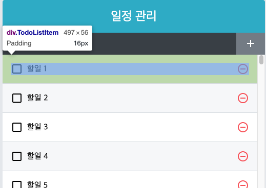

# Performance upgrade 

---

# 느려지는 원인
## 컴포넌트가 리렌더링 되는 상황
- 자신이 전달받은 props가 변경될 때
- 자신의 state가 바뀔 때
- 부모 컴포넌트가 리렌더링 될때
- forceUpdate 함수가 실행될 때

---

# List 사용할 경우
- list가 엄청나게 클 경우에는?
1. App 컴포넌트의 state 변경되면서 App 컴포넌트가 리렌더링
2. 부모 컴포넌트가 리렌더링 되면 자식 컴포넌트도 리렌더링 됨
-> 성능 저하

---

# React.memo를 사용한 컴포넌트 성능 최적화
- shoudComponentUpdate 라이프사이클 메소드 사용(클래스형 컴포넌트)
- React.memo 사용(함수형 컴포넌트)
  - Props가 바뀌었을 때만 리렌더링
- 사용법 
  - `export default React.memo(function name)`
- TIP : Chrome extension - React Developer Tool
  - https://chrome.google.com/webstore/detail/react-developer-tools/fmkadmapgofadopljbjfkapdkoienihi/related?hl=en
  
***

- 컴포넌트가 react.memo()로 래핑 되면, react 컴포넌트를 렌더링하고 결과를 memoizing 함
- 다음 렌더링이 일어나면 props가 같으면 react는 메모이징 내용을 재사용

***

### example
```js
export function Movie({ title, releaseDate }) {
  return (
    <div>
      <div>Movie title: {title}</div>
      <div>Release date: {releaseDate}</div>
    </div>
  );
}

export const MemoizedMovie = React.memo(Movie);
```
- React.memo(Movie)는 새로 메모이징된 컴포넌트 MemoizedMovie를 반환
- title, releaseData와 같은 props가 변경되지 않으면 다음렌더링때 메모이징 된 내용을 그대로 사용
---

# useState의 함수형 업데이트
- `setState()` 사용시 상태를 파라미터로 넣는 대신 상태의 업데이트를 어떻게 할 지에 대한 함수를 넣음
- 컴포넌트 최적화시 주로 사용
  
```js
const onIncrease = () => {
  setNumber(number + 1);
}
```
```js
const onIncrease = () => {
  setNumber(prevNumber => prevNumber + 1);
}
```

---

# 불변성의 중요성

```js
const onToggle = useCallback(id=> {
  setTodos(todos =>
    todos.map(todo=>
      todo.id === id ? { ...todo, checked: !todo.checked } : todo,
    ),
  );
}, [])
```
- 기존 데이터를 직접 수정하지 않고 새로운 배열을 만든 다음에 새로운 객체를 만들어 필요한 
부분을 교체
- 새로운 배열 또는 객체이기 때문에 React.memo 사용시 props 변경 유무를 확인해 리렌더링 성능을 최적화 함
- 불변성이 지켜지지 않으면 객체 내부의 값이 바뀌어도 감지하지 못함

***

### Javascript 타입
- Primitive Type
  - Boolean, null, undefined, string, Number
  - 데이터 전달시 실제 value가 복사
- Reference Type
  - Array, Function, Object
  - 데이터 전달시 해당 객체의 주소값이 전달(reference 전달)

***

## shallow copy
- ES6 이후 기준 
  - Object.assign()
  - spread 연산자 ({...})


### Primitive Type
```js
var original = '원본';
var copy = original;
console.log('copy의 값은?', copy); // 원본
    
copy = '복제품';
console.log('original의 값은?', original); // 원본
console.log('copy의 값은?', copy); // 복제품
```

***

### Objects
```js
  let original = { a: 1, b: { c: 1 } };
  console.log('original :', JSON.stringify(original)); //  {"a":1,"b":{"c":1}}
  let copy = original;
  let spreadCopy1 = { ...original };
  let spreadCopy2 = { ...original, 
    b : {...original.b}
   };

   copy.a = 2;
   copy.b.c = 3;

  console.log('original : ', JSON.stringify(original));       // {"a":2,"b":{"c":3}}
  console.log('copy : ', JSON.stringify(copy));               // {"a":2,"b":{"c":3}}
  console.log('spreadCopy1 : ', JSON.stringify(spreadCopy1)); // {"a":1,"b":{"c":3}}
  console.log('spreadCopy2 : ', JSON.stringify(spreadCopy2)); // {"a":1,"b":{"c":1}}
```

---

# immer.js
- state update가 까다올때 사용
- 불변성을 유지하는 코드가 복잡할 때 사용하는것을 추천
- `yarn add immer`

***

### immer 사용법

```js
import produce from 'immer';

...

 const original = [{ a: 1, b: { c: 1 } }];
  console.log('original :', JSON.stringify(original)); //   [{"a":1,"b":{"c":1}}]
  
   const nextState = produce(original, draftState => {
    draftState[0].a = 12;
    draftState[0].b.c = 12;
    draftState.push({test : "test"}) //immer가 알아서 관리해주기 때문에 push도 사용 가능
  });

  console.log('original : ', JSON.stringify(original));       // [{"a":1,"b":{"c":1}}]
  console.log('nextState : ', JSON.stringify(nextState));     // [{"a":12,"b":{"c":12}},{"test":"test"}]
```

***

### immer 사용법(In reducer)
```js
function reducer(state, action)
{
	switch(action.type){
    	case 'CREATE_USER':
        	return produce(state, draft => {
            	draft.users.push(action.user);
        });
    }
}
```

---

# react-virtualized를 사용한 렌더링 최적화
- 리스트 컴포넌트가 스크롤되기 전에 보이지 않는 앟는 컴포넌트는 렌더링 하지 않음
- 스크롤을 하면 해당 스크롤 위치에서 보여줄 컴포넌트를 렌더링
- `yarn add react-virtualized`


https://github.com/bvaughn/react-virtualized

***

### 예제
<!-- _class: split -->

<div class=ldiv>

#### list 항목 size 확인

</div>
<div class=rdiv>

#### TodoList
``` js
const TodoList = ({ todos, onRemove, onToggle }) => {
  return (
    <div className="TodoList">
      {todos.map(todo => (
        <TodoListItem
          todo={todo}
          key={todo.id}
          onRemove={onRemove}
          onToggle={onToggle}
        />
      ))}
    </div>
  );
};
``` 
</div>

***

### react-virtualized List component

```js
import { List } from 'react-virtualized';
...

const TodoList = ({ todos, onRemove, onToggle }) => {
  const rowRenderer = useCallback(
    ({ index, key, style }) => {
      const todo = todos[index];
      return (
        <TodoListItem
          todo={todo}
          key={key}
          onRemove={onRemove}
          onToggle={onToggle}
          style={style}
        />
      );
    },
    [onRemove, onToggle, todos],
  );
  return (
    <List
      className="TodoList"
      width={497} // 전체 크기
      height={497} // 전체 높이
      rowCount={todos.length} // 항목 개수
      rowHeight={56} // 항목 높이
      rowRenderer={rowRenderer} // 항목을 렌더링할 때 쓰는 함수
      list={todos} // 배열
      style={{ outline: 'none' }} // List에 기본 적용되는 outline 스타일 제거
    />
  );
};                                                                                                                                                    
```
